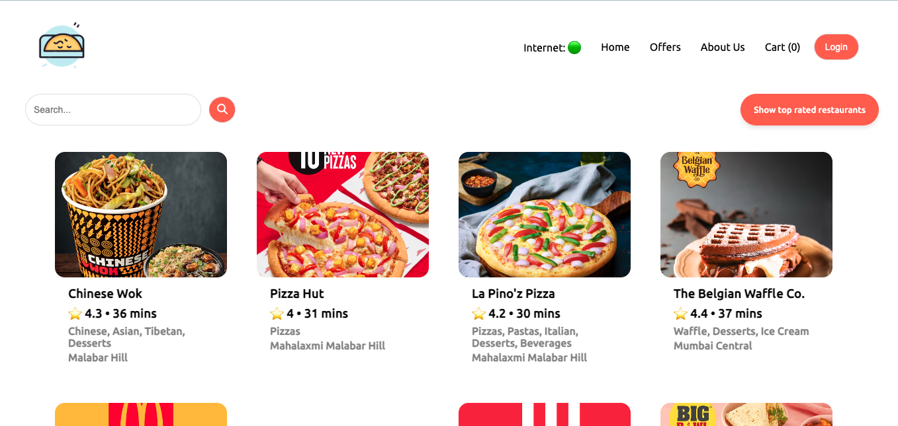
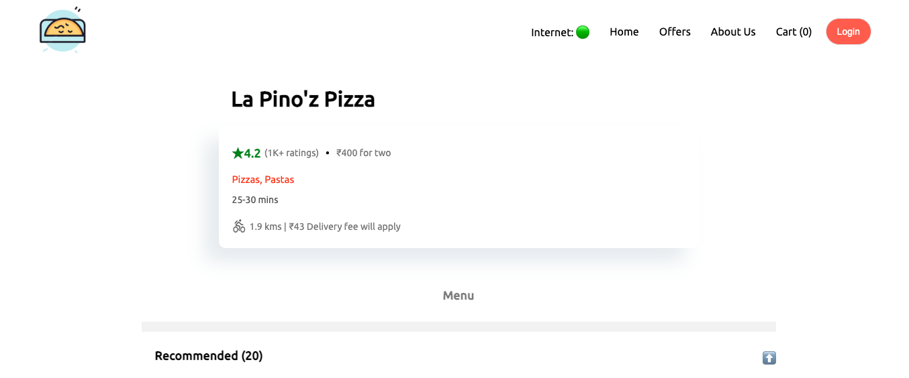
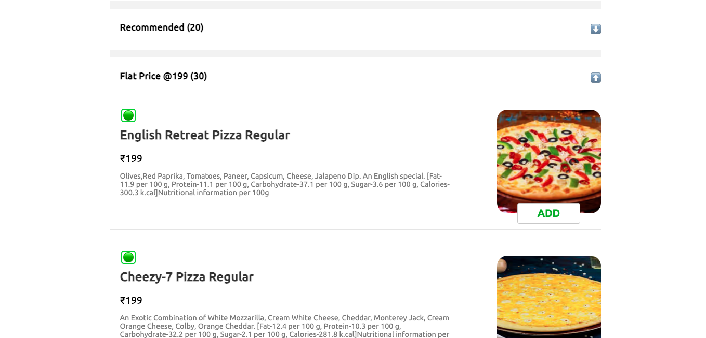
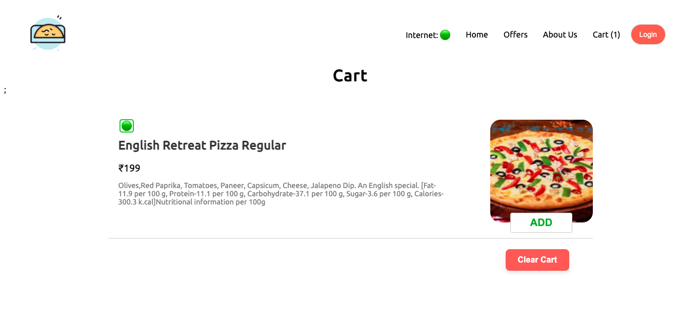

# Food Delivery App Frontend

Welcome to the Food Delivery App Frontend, a React-based web application that provides users with a seamless experience to browse and order food from various restaurants. The app fetches live data from Swiggy's API, ensuring that users always have up-to-date information on available restaurants, menus, and promotions.

## UI Screenshots

Here are some screenshots of the user interface:

### Home Page



### Restaurant Page




### Cart Page



## Features

- Browse a variety of restaurants and cuisines.
- View detailed restaurant information and menu items.
- Add items to the cart.
- Responsive design for optimal viewing on different devices.
- Live data integration from Swiggy's API.

## Technologies Used

- **React**: A JavaScript library for building user interfaces.
- **Redux**: State management for managing the app's state.
- **React Router**: For handling navigation within the app.
- **CSS Modules**: For styling components.

## Installation

1. Clone the repository:

   ```bash
   git clone https://github.com/your-username/food-delivery-app-frontend.git
   cd food-delivery-app-frontend
   ```

2. Install the dependencies:

   ```bash
   npm install
   ```

## Usage

1. Start the development server:

   ```bash
   npm run dev
   ```

2. Open your browser and navigate to `http://localhost:3000`.

## Contact

For any inquiries or feedback, please reach out to [lakshitcollege.com](mailto:your-email@example.com).

---

Happy coding :)
